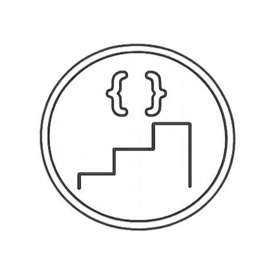

# 한번에 하나씩 CS

<p align="center">
  
</p>

> 바이브 코딩 시대, 코드는 AI가 짜주지만 **CS 기본기**는 결국 사람의 몫입니다.
> "한번에 하나씩 CS"는 비전공자와 입문자를 위해 컴퓨터 과학 핵심 개념을 한 입 크기로 정리한 셀프 학습 플랫폼입니다.

## 주요 기능

- **12개 주제 · 71개 학습 문서** — 자료구조, OS, 네트워크, 데이터베이스, 시스템 설계, AI, 인프라, AI 에이전트, 소프트웨어 아키텍처, 디버깅, Git, 테스팅
- **인터랙티브 다이어그램** — React Flow 기반 플로우차트 (노드 드래그/줌) + Mermaid 특수 다이어그램
- **학습 가이드 & 로드맵** — 4개 영역(CS 기초 → 시스템 & 설계 → AI → 개발 실무) 기반 학습 순서 안내
- **목차 네비게이션** — 문서 우측 TOC 패널, 스크롤 스파이 하이라이트
- **퀴즈 & 플래시카드** — 주제별 랜덤 출제로 복습 (1,700+ 문항)
- **학습 대시보드** — localStorage 기반 진행률 추적
- **MDX 기반 콘텐츠** — 코드 하이라이팅, Mermaid 다이어그램 지원
- **AI 채팅 & RAG 검색** — Ollama 기반 로컬 LLM 채팅 + 3-레이어 검색

## 기술 스택

| 영역 | 기술 |
|------|------|
| 프레임워크 | Next.js 16 (App Router) |
| 언어 | TypeScript, React 19 |
| 스타일링 | Tailwind CSS v4 |
| 콘텐츠 | MDX (`next-mdx-remote`) |
| 시각화 | React Flow (`@xyflow/react`), Mermaid |
| 애니메이션 | Framer Motion |
| DB | Prisma + SQLite (학생 데이터, 임베딩 청크) |
| 로컬 LLM | Ollama (채팅 + 임베딩) |

## 시작하기

```bash
git clone https://github.com/GatsLee/one-by-one-cs.git
cd one-by-one-cs
npm install
npx prisma generate
npm run dev
```

브라우저에서 `http://localhost:3000` 접속

> AI 채팅 & 검색 기능은 Ollama가 필요합니다. 설정 방법은 [docs/ai-chat.md](./docs/ai-chat.md)를 참고하세요.

## 프로젝트 구조

```
├── content/topics/       # MDX 학습 문서 (12개 주제)
├── docs/                 # 상세 문서
│   ├── ai-chat.md        # AI 채팅 & 검색 설정 가이드
│   └── rag-search.md     # 3-레이어 검색 시스템 아키텍처
├── src/
│   ├── app/              # Next.js App Router 페이지
│   │   └── api/          # API 라우트 (chat, embed, search, models, ollama)
│   ├── components/       # UI 컴포넌트
│   │   ├── home/         # 홈 화면 (로드맵, 가이드)
│   │   ├── mdx/          # MDX 렌더링 (TOC, Mermaid, React Flow 분기)
│   │   └── viz/          # 인터랙티브 시각화 컴포넌트
│   ├── data/             # 퀴즈 & 플래시카드 데이터
│   └── lib/              # 유틸리티 (콘텐츠 파싱, Mermaid 파서, RAG 등)
├── prisma/               # DB 스키마 (Student, Flashcard, ContentChunk)
└── public/               # 정적 파일
```

## 앞으로 추가될 기능

- [x] **LLM 채팅 연동** — 학습 중 모르는 개념을 AI에게 바로 질문
- [x] **RAG 채팅** — 강의 문서 기반 근거 답변
- [x] **3-레이어 AI 검색** — 제목·태그·임베딩 순차 검색, SSE 스트리밍으로 결과 즉시 표시
- [x] **인터랙티브 다이어그램** — React Flow 플로우차트 + Mermaid 특수 다이어그램
- [x] **목차 네비게이션** — 우측 TOC 패널, 스크롤 스파이
- [ ] **개인별 취약점 분석** — 퀴즈 결과 기반으로 약한 주제 추천
- [ ] **스페이스드 리피티션** — 에빙하우스 망각 곡선 기반 복습 스케줄링
- [ ] **코드 실행 환경** — 브라우저에서 직접 코드를 실행하고 결과 확인
- [ ] **다크 모드** — 눈이 편한 다크 테마 지원

## 라이선스

MIT
