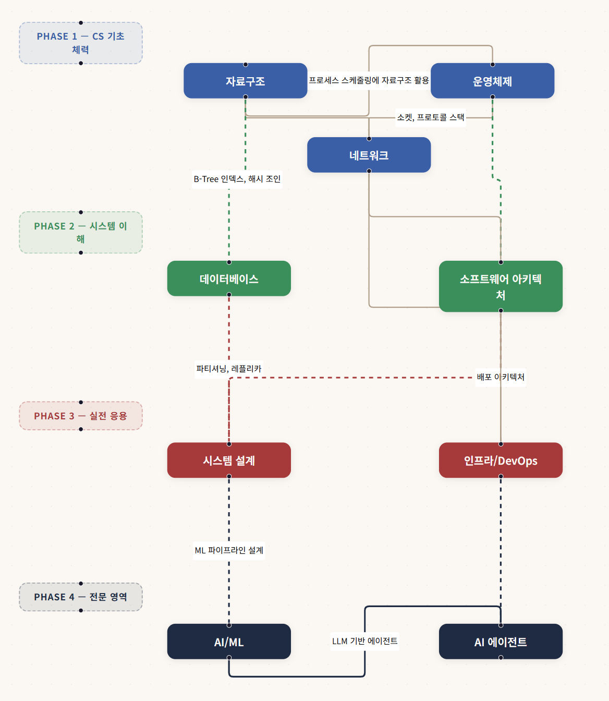

# 한번에 하나씩 CS

<!-- 스크린샷을 찍어서 아래 경로에 넣어주세요 -->


> 바이브 코딩 시대, 코드는 AI가 짜주지만 **CS 기본기**는 결국 사람의 몫입니다.
> "한번에 하나씩 CS"는 비전공자와 입문자를 위해 컴퓨터 과학 핵심 개념을 한 입 크기로 정리한 셀프 학습 플랫폼입니다.

## 주요 기능

- **9개 주제 · 57개 학습 문서** — 자료구조, OS, 네트워크, 데이터베이스, 시스템 설계, AI, 인프라, AI 에이전트, 소프트웨어 아키텍처
- **인터랙티브 학습 로드맵** — React Flow 기반 시각화로 학습 순서를 한눈에 파악
- **퀴즈 & 플래시카드** — 주제별 랜덤 출제로 복습 (1,700+ 문항)
- **학습 대시보드** — localStorage 기반 진행률 추적
- **MDX 기반 콘텐츠** — 코드 하이라이팅, Mermaid 다이어그램 지원
- **AI 채팅 (로컬 LLM)** — Ollama 기반 로컬 LLM 채팅. 하드웨어 사양에 맞는 모델 자동 추천
- **RAG 채팅** — 57개 강의 문서를 임베딩해 관련 내용을 근거로 답변
- **3-레이어 AI 검색** — 제목 정규화 매칭 → 태그 키워드 매칭 → 임베딩 RAG 순서로 즉각 결과 반환. LLM은 최종 답변 생성에만 사용

## 기술 스택

| 영역 | 기술 |
|------|------|
| 프레임워크 | Next.js 16 (App Router) |
| 언어 | TypeScript, React 19 |
| 스타일링 | Tailwind CSS v4 |
| 콘텐츠 | MDX (`next-mdx-remote`) |
| 시각화 | React Flow (`@xyflow/react`), Mermaid |
| 애니메이션 | Framer Motion |
| DB | Prisma + SQLite (학생 데이터, 임베딩 청크) |
| 로컬 LLM | Ollama (채팅 + 임베딩) |

## 시작하기

### 필수 조건

- **Node.js** 20 이상
- **npm** (또는 yarn, pnpm)
- **Ollama** — AI 채팅 기능을 사용하려면 필요 (선택 사항)

### 설치 및 실행

```bash
# 레포 클론
git clone https://github.com/GatsLee/one-by-one-cs.git
cd one-by-one-cs

# 의존성 설치
npm install

# Prisma 초기화
npx prisma generate

# 개발 서버 실행
npm run dev
```

브라우저에서 `http://localhost:3000` 접속

### AI 채팅 & 검색 (선택 사항)

AI 채팅 및 검색 기능은 [Ollama](https://ollama.com)가 필요합니다. 자세한 내용은 [docs/ai-chat.md](./docs/ai-chat.md)를 참고하세요.

```bash
# 1. Ollama 설치
curl -fsSL https://ollama.com/install.sh | sh

# 2. 채팅 모델 설치 (사양에 맞게 선택 — /chat 페이지에서 자동 추천)
ollama pull llama3.2          # 경량 (VRAM 3GB~)
ollama pull llama3.1:8b       # 균형 (VRAM 6GB~)
ollama pull qwen2.5:14b       # 고품질 (VRAM 10GB~)

# 3. 임베딩 모델 설치 (RAG 채팅 & AI 검색 모두 필요)
ollama pull mxbai-embed-large

# 4. /settings 접속 → "인덱싱 시작" 클릭 (태그 + 임베딩 생성)
# 5. /search 에서 AI 검색, /chat 에서 RAG 채팅 사용
```

#### AI 검색 동작 방식

검색 요청이 들어오면 3개 레이어를 순서대로 실행합니다:

| 레이어 | 방식 | 속도 | 비고 |
|--------|------|------|------|
| Layer 1 | 제목 정규화 매칭 | <1ms | 한국어 어미/조사 제거 후 제목 비교 |
| Layer 2 | 태그 키워드 매칭 | <5ms | 인덱싱 시 생성한 20-30개 태그 in-memory 검색 |
| Layer 3 | 임베딩 RAG | ~2-5s | 코사인 유사도 기반 의미 검색 |

앞 레이어에서 찾은 문서는 뒤 레이어에서 자동 제외(중복 방지). 자세한 구현은 [docs/rag-search.md](./docs/rag-search.md) 참고.

### 프로덕션 빌드

```bash
npm run build
npm start
```

## 프로젝트 구조

```
├── content/topics/       # MDX 학습 문서 (9개 주제)
├── docs/                 # 상세 문서
│   ├── ai-chat.md        # AI 채팅 & RAG 설정 가이드
│   └── rag-search.md     # 3-레이어 검색 시스템 아키텍처
├── src/
│   ├── app/              # Next.js App Router 페이지
│   │   └── api/          # API 라우트 (chat, embed, search, models, ollama)
│   ├── components/       # UI 컴포넌트
│   ├── data/             # 퀴즈 & 플래시카드 데이터
│   └── lib/              # 유틸리티 (콘텐츠 파싱, RAG 등)
├── prisma/               # DB 스키마 (Student, Flashcard, ContentChunk)
└── public/               # 정적 파일
```

## 앞으로 추가될 기능

- [x] **LLM 채팅 연동** — 학습 중 모르는 개념을 AI에게 바로 질문
- [x] **RAG 채팅** — 강의 문서 기반 근거 답변
- [x] **3-레이어 AI 검색** — 제목·태그·임베딩 순차 검색, SSE 스트리밍으로 결과 즉시 표시
- [ ] **개인별 취약점 분석** — 퀴즈 결과 기반으로 약한 주제 추천
- [ ] **스페이스드 리피티션** — 에빙하우스 망각 곡선 기반 복습 스케줄링
- [ ] **코드 실행 환경** — 브라우저에서 직접 코드를 실행하고 결과 확인
- [ ] **다크 모드** — 눈이 편한 다크 테마 지원

## 라이선스

MIT
